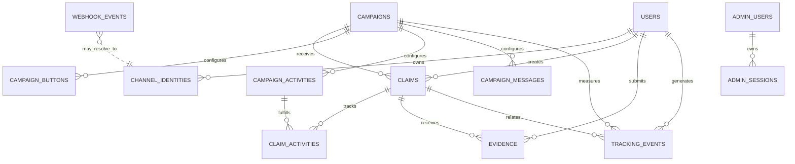

# Architecture

## Implemented scope through Phase 3

The foundation separates provider adapters, application services, domain rules, and persistence. It provides a durable inbox, reusable campaign/claim primitives, and the Phase 2 follow/welcome and claim/activity reply flow.

```text
LINE webhook
  -> raw body signature verification
  -> event parsing/normalization
  -> webhook inbox (unique provider event identity, retry schedule, lease)
  -> event processor (FOR UPDATE SKIP LOCKED, expired-lease recovery)
  -> campaign and claim services
  -> outbound reply ledger (at-most-once on uncertain reply result)
  -> LINE Messaging API

Admin browser
  -> same-origin session + CSRF boundary
  -> campaign admin service (versioned transactional writes)
  -> campaign, template, and audit data
  -> shared LINE campaign renderer for preview and webhook replies
```

The Admin API calls the same campaign services and LINE renderer used by Phase 2 delivery. Business logic must not hard-code campaign identifiers or credentials.

## Stack decision

Node.js 24 LTS + TypeScript, Fastify 5, PostgreSQL, Drizzle ORM/Kit, and Vitest. This is one deployable API foundation with explicit SQL migrations, strict TypeScript checks, and simple local operation. Node 24 LTS and supported library documentation were checked on 2026-09-26; recheck versions when upgrading.

References: [Node.js release schedule](https://nodejs.org/en/about/previous-releases), [Fastify TypeScript guide](https://fastify.dev/docs/latest/Reference/TypeScript/), and [Drizzle migrations](https://orm.drizzle.team/docs/migrations).

## Logical ER diagram



`webhook_events` is a durable leased inbox; `outbound_messages` stores prepared replies and send-state evidence. Campaigns have dynamic activity rows (`1..N`); the example seed happens to add four. Active campaign content is protected by DB triggers that lock the parent campaign and require pausing before changes.

## Phase boundaries

- Phase 1: database and reusable domain/application foundation. Only `SINGLE_CLAIM` is supported; other policies are explicitly rejected.
- Phase 2 (done): follow/welcome and configured claim postback response, including dynamic activity card and conservative outbound status handling.
- Phase 3 (done): authenticated admin campaign editor, preview, and publishing; secure first-admin bootstrap; draft duplication; version conflicts and audit history.
- Phase 4: evidence intake and review.
- Phase 5: analytics and optimization.
