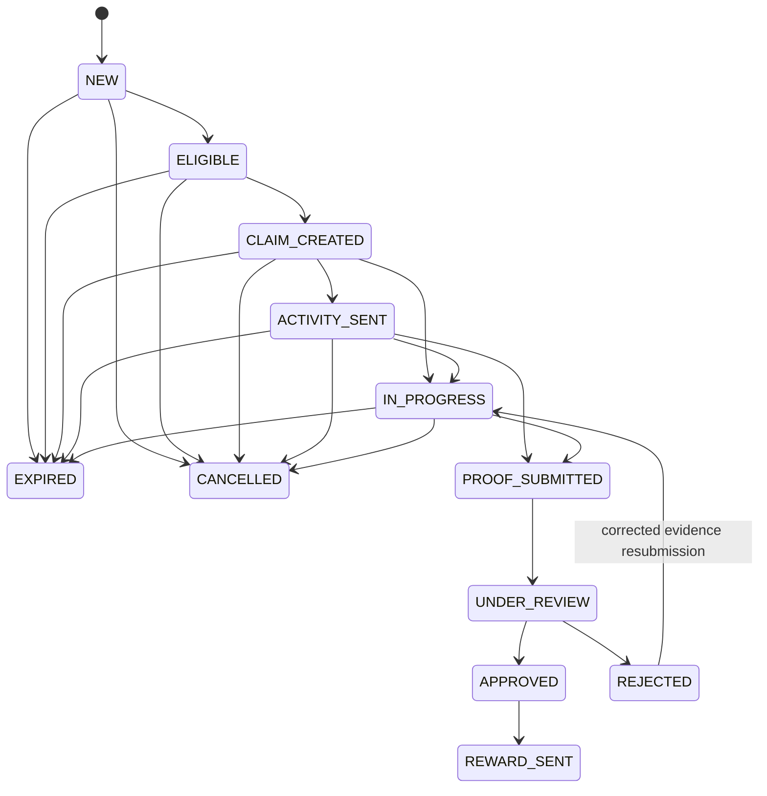

# Claim state machine

State transitions are validated in `src/domain/claim-state.ts`, independently of HTTP handlers and LINE.

`REWARD_SENT`, `EXPIRED`, and `CANCELLED` are terminal. A rejected claim can resume `IN_PROGRESS` when a customer selects an eligible activity and starts a new upload context. The previous rejected evidence and reason remain in history. Approval occurs only after every enabled required claim activity is approved. Approving proof does not send or record a reward; `REWARD_SENT` is outside Phase 4. Invalid transitions throw `DomainError` with code `INVALID_CLAIM_TRANSITION`.
