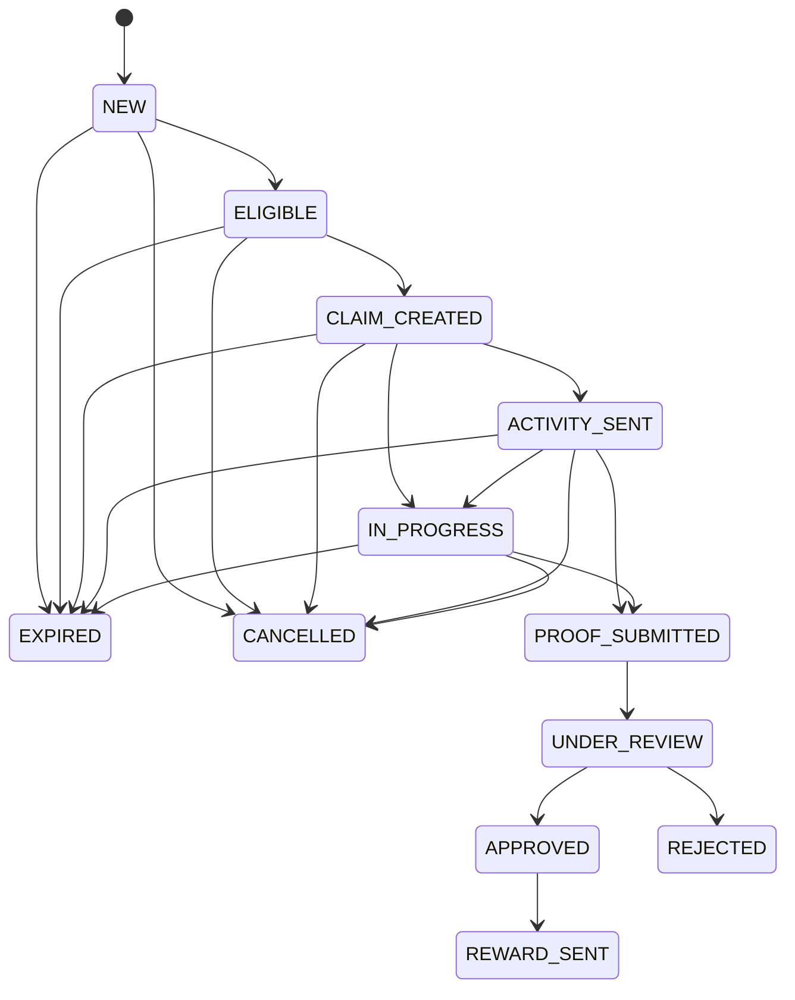

# Claim state machine

State transitions are validated in `src/domain/claim-state.ts`, independently of HTTP handlers and LINE.

`REJECTED`, `REWARD_SENT`, `EXPIRED`, and `CANCELLED` are terminal in this foundation. Invalid transitions throw `DomainError` with code `INVALID_CLAIM_TRANSITION`.
